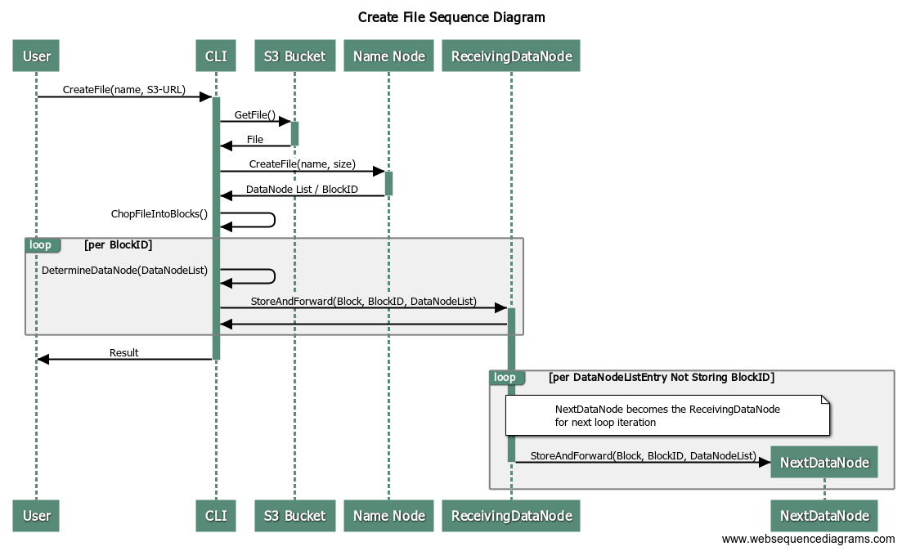

## Component API Calls

We are using RESTful endpoints to communicate between the components. Only JSON is supported.

### Name Node API

#### Create File Request

path: "/createFile"

```json
{
    "FileName": string, // the filename SUFS will use
    "Size": string // this number of bytes in the file
}
```

#### Create File Response

```json
{
    "BlockInfos": [ // in-order list of info for each block
        {
            "BlockId": string, // the internal id of the block
            "DataNodeList": [ // list of Data Nodes the block should be stored on
                string // IP address and port of the Data Node (ex: "10.0.0.1:8080")
            ]
        }
    ],
    "Error": string // description of the error, empty means no error
}
```

#### Get File Request

path: "/getFile"

```json
{
    "FileName": string, // the filename in SUFS
}
```

#### Get File Response

```json
{
    "BlockInfos": [ // in-order list of info for each block
        {
            "BlockId": string, // the internal ID of the block
            "DataNodeList": [ // list of Data Nodes the block should be stored on
                string // IP address and port of the Data Node (ex: "10.0.0.1:8080")
            ]
        }
    ],
    "Error": string // description of the error, empty means no error
}
```

#### Block Report Request

path: "/blockReport"

```json
{
    "MyIp": string, // the public IP address of the sending Data Node
    "BlockIds": []string // the list of IDs of each block stored on the sending Data Node
}
```

#### Block Report Response

```json
{
    "Error": string // description of the error, empty means no error
}
```

#### Heartbeat

<span style="color:red">FINISH ME</span>

### Data Node API

#### Store Block Request

path: "/storeBlock"

```json
{
    "Block": string, // base64 encoded block data
    "DataNodeList": [ // list of Data Nodes the block should be stored on
                string // IP address and port of the Data Node (ex: "10.0.0.1:8080")
    ],
    "BlockId": string // the internal ID of the block
}
```

#### Store Block Response

```json
{
    "Error": string // description of the error, empty means no error
}
```

#### Get Block Request

path: "/getBlock"

```json
{
    "BlockId": string // the internal ID of the block
}
```

#### Get Block Response

```json
{
    "Block": string, // base64 encoded block data
    "Error": string // description of the error, empty means no error
}
```

### CLI

Each command can include the `-v` option. This turns verbose mode on. When verbose mode is on the CLI will output log statements as it performs the action.

#### Create File Command

```bash
/path/to/CLI create-file <name_node_address_and_port> <file_name> <s3_url>
```

* name_node_address_and_port
  * address is required
  * :port is optional
  * ex: "10.0.0.8", "10.0.0.8:8080"
* file_name
  * the name of the file in SUFS
* s3_url
  * the URL of the file to put into SUFS

#### Get File Command

```bash
/path/to/CLI get-file <name_node_address_and_port> <file_name> <save_location>
```

* name_node_address_and_port
  * address is required
  * :port is optional
  * ex: "10.0.0.8", "10.0.0.8:8080"
* file_name
  * the name of the file in SUFS
* save_location
  * the location on the local host to save the file

#### List Data Nodes File Command

```bash
/path/to/CLI list-data-nodes <name_node_address_and_port> <file_name>
```

* name_node_address_and_port
  * address is required
  * :port is optional
  * ex: "10.0.0.8", "10.0.0.8:8080"
* file_name
  * the name of the file in SUFS

## System Design




### Data Node

The StoreBlock API is used by the CLI to store new blocks and by the Name Node for fault recovery.

The Data Node will store the block if it's address is in the Data Node list in the StoreBlock API. Then, it will remove it's address from the list and forward the request to another Data Node also in that list.

## Technologies and Tools Used

* Go
  * Using `http` library for all REST calls
* Git
  * Storing all code, documents, and images in a private repo
  * [GitHub Repository](https://github.com/Rivukis/Cloud-Computing-Project)

## System Parameters
* Block Size: 64MB
* Replication Factor: 3
* Total DataNode: 4

## Project State

### Completed

* System design
* Tools and technologies decided
* Basic implementation of creating and getting files
  * CLI
  * Name Node
  * Data Node

### In Progress

* Block Report
  * timeouts in Name Node
  * send block report from Data Node
* End-to-end testing
  * successfully created a file (localhost only)

### Needs to be started

* Heartbeat from Data Nodes to Name Node
* List Data Nodes Command
* AWS Setup
