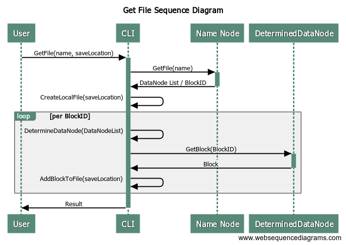
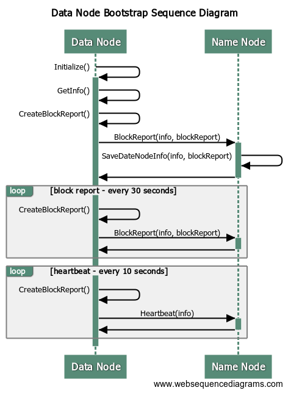

# Notes for Creating Design Documents

## Create File Sequence Diagram


### Recreate Diagram

[Web Sequence Diagram](https://www.websequencediagrams.com)

```websequencediagrams
title Create File Sequence Diagram

User->+CLI: CreateFile(name, S3-URL)
CLI->+S3 Bucket: GetFile()
S3 Bucket->-CLI: File
CLI->+Name Node: CreateFile(name, size)
Name Node->-CLI: DataNode List / BlockID
CLI->CLI: ChopFileIntoBlocks()

loop per BlockID
CLI->CLI: DetermineDataNode(DataNodeList)
CLI->+ReceivingDataNode: StoreAndForward(Block, BlockID, DataNodeList)
ReceivingDataNode->CLI:
end

CLI->-User: Result

loop per DataNodeListEntry Not Storing BlockID
note over ReceivingDataNode,NextDataNode:
    NextDataNode becomes the ReceivingDataNode
    for next loop iteration
end note
ReceivingDataNode->*-NextDataNode: StoreAndForward(Block, BlockID, DataNodeList)
end
```

## Get File Sequence Diagram



```websequencediagrams
title Get File Sequence Diagram

User->+CLI: GetFile(name, saveLocation)
CLI->+Name Node: GetFile(name)
Name Node->-CLI: DataNode List / BlockID

CLI->CLI: CreateLocalFile(saveLocation)

loop per BlockID
CLI->CLI: DetermineDataNode(DataNodeList)
CLI->+DeterminedDataNode: GetBlock(BlockID)
DeterminedDataNode->-CLI: Block
CLI->CLI: AddBlockToFile(saveLocation)
end

CLI->-User: Result
```

## Data Node Bootstrap Sequence Diagram



```websequencediagrams
title Data Node Bootstrap Sequence Diagram

Data Node->+Data Node: Initialize()
Data Node->Data Node: GetInfo()
Data Node->Data Node: CreateBlockReport()
Data Node->+Name Node: BlockReport(info, blockReport)
Name Node->Name Node: SaveDateNodeInfo(info, blockReport)
Name Node->-Data Node:

loop block report - every 30 seconds
Data Node->Data Node: CreateBlockReport()
Data Node->+Name Node: BlockReport(info, blockReport)
Name Node->-Data Node:
end

loop heartbeat - every 10 seconds
Data Node->Data Node: CreateBlockReport()
Data Node->+Name Node: Heartbeat(info)
Name Node->-Data Node:
end
```
